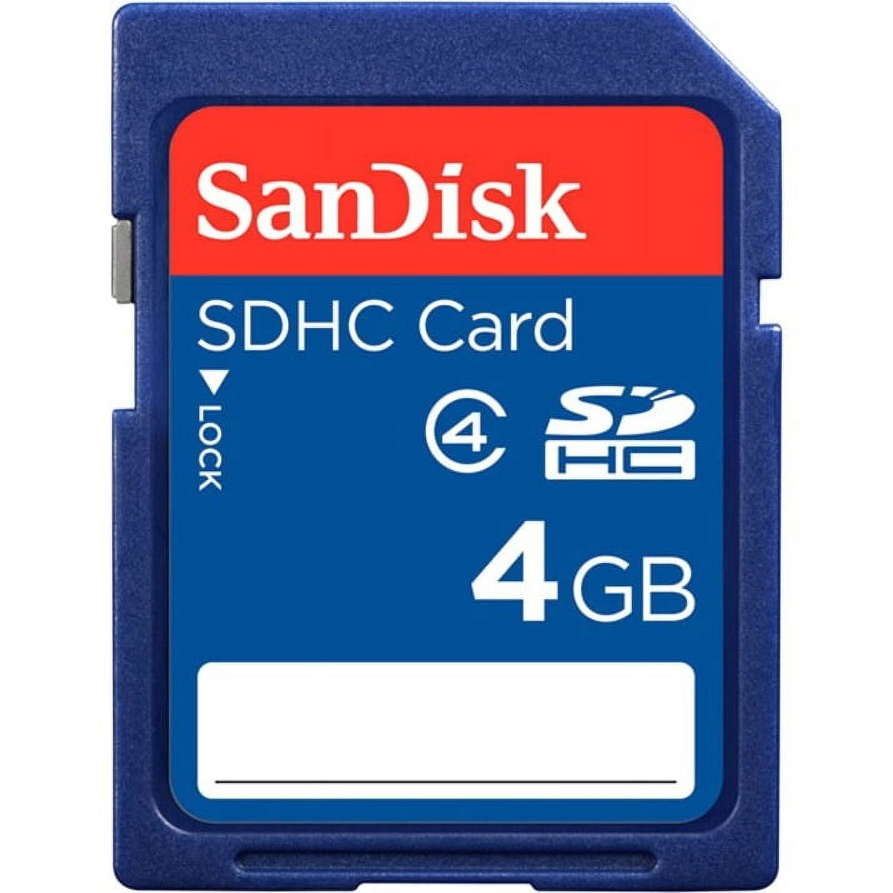
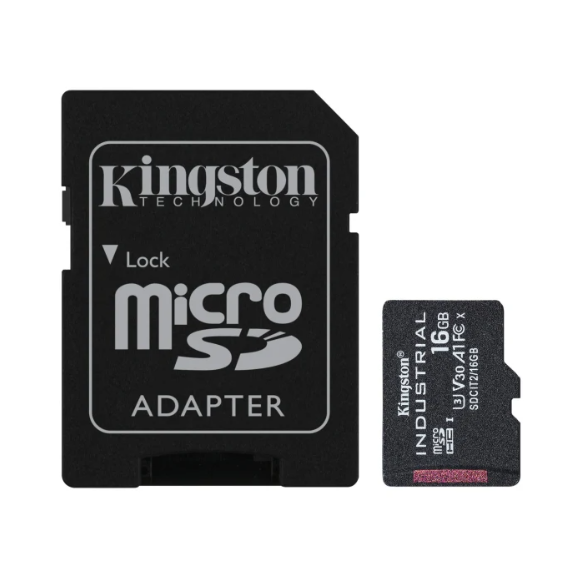
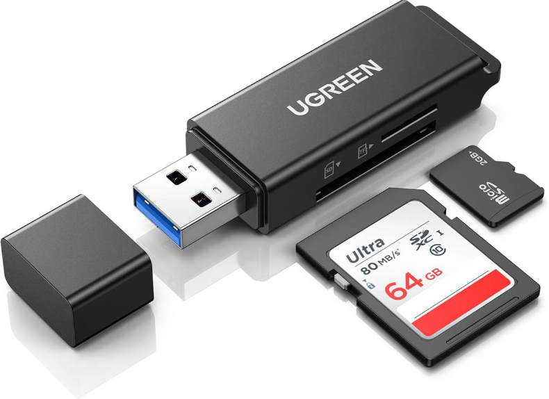

## Algo de contexto

<!-- Sugerencia de imagen: foto de Bit-0 con una memoria SD insertada (plano detalle del puerto superior). -->

Desde el principio, cuando estábamos diseñando **Bit-0**, pensamos en una forma para que pudiera interactuar con juegos “físicos”, similar a como se hacía en la era de los cartuchos con la **Game Boy** y otras **consolas de 8 y 16 bits**. La solución a la que llegamos en este prototipo fue incluir un **puerto para memorias SD**.

Por ahora (y como algo experimental) lo hacemos con la ayuda de:

* El comando `~# card` desde el terminal.
* Un **archivo** con la **ruta de destino** de los juegos.

### [Pico-8 👾](https://www.lexaloffle.com/pico-8.php)

")

En los últimos talleres de verano usamos una plataforma para programar juegos de 8-bits en LUA, [**Pico-8**](https://www.lexaloffle.com/pico-8.php) es un “fantasy console” con miles y miles de juegos. Existen muchas gemas ocultas hechas por la comunidad: aventura, pelea, arcade, etc. 

> 💡 **Idea:** Si tienes un proyecto en mente, es muy probable que existan varios juegos similares de los que puedas inspirarte.

La mejor parte (en mi opinión) es que los juegos de **Pico-8** son *abiertos*: puedes abrir todo el código y ver cómo consiguieron que algo funcione.

En esta guía te mostramos el proceso para **cargar juegos de Pico-8 desde una memoria SD**, qué materiales necesitas y cómo configurarlos.

## Antes de comenzar ✅

Para esto necesitaremos:

* Una consola con **Pico-8** instalado.
* Un computador.
* Una memoria SD (de las grandes o una Micro SD con su adaptador).
* Un adaptador para conectarla en el computador.

> [!IMPORTANT]
> La capacidad de la memoria SD debe ser idealmente de 64 GB o menos, las memorias más grandes pueden tardar mucho en leer o directamente no funcionar.


  
  
  


## 1. Preparar la memoria SD 💾

Conecta la memoria SD al computador y **formatea** en **FAT32** o **exFAT**. Debe quedar limpia y sin ningún archivo.

Existen múltiples guías de cómo hacer esto dependiendo de qué computador estén usando, Windows, Mac, Linux...




> [!WARNING]
> En este paso vas a **borrar todo** lo que exista en la SD. Si tienes cosas importantes, respáldalas primero.

## 2. Definir la ruta de destino de los juegos 📁

En la **raíz** de la memoria SD tenemos que crear un archivo de texto `.txt` llamado `dir.txt`. 

Dentro de él va (en una sola línea) la ruta donde se guardarán tus juegos:

```text
./root/pico-8/carts/
```

> ✅ **Tip:** asegúrate de que el archivo se llame exactamente `dir.txt` (sin `.txt.txt`) a veces los sistemas operativos no incluyen el formato en el nombre, siempre podrán revisar cómo se llama finalmente revisando las propiedades del archivo.

## 3. Agregar juegos 🕹️

Dentro de la raíz de la memoria SD podrás agregar los juegos que quieras. Para obtenerlos puedes ir al [BBS de Lexaloffle](https://www.lexaloffle.com/bbs/?cat=7&carts_tab=1&sub=2&mode=carts&orderby=featured) y descargarlos como `.png` haciendo clic en la esquina inferior de la tarjeta del juego ("cart").

> 📝 **Nota:** el juego viene dentro de la misma imagen `.png` del cartucho.

<div style="max-width: 80%; margin: 0 auto;">

</div>

Una vez que tengamos nuestros juegos y hayamos agregado nuestro archivo `dir.txt`, la raíz de la memoria debería tener más o menos esta estructura:
<div style="max-width: 70%; margin: 0 auto;">

</div>

## 4. Cargar ROMs en Bit-0 🚀

Retira la memoria SD del computador y colócala en el **puerto superior** de Bit-0 con la **etiqueta mirando hacia abajo**. Al encender la consola e iniciar sesión, ya podrás copiar los juegos ejecutando estos comandos:

Primero, monta la tarjeta ejecutando:

```bash
~# card
```

Si no arroja ningún error, ejecuta el comando de copia:

```bash
~# card copy
```

Y listo. Si lees la respuesta, te dirá que los juegos se copiaron en la carpeta indicada en `dir.txt`.

<div style="max-width: 70%; margin: 0 auto;">

</div>

> 🧯 **Si algo falla:** revisa que `dir.txt` exista en la raíz de la SD y que tus juegos estén en formato `.png`.

## 5. Abrir juegos y jugar ✨

Desde tu consola en Bit-0 abre pico-8 con el comando:

```bash
pico8
```

Dentro del terminal de Pico-8 ejecuta:

```lua
ls
```

Verás un listado de los juegos que se copiaron. Ahora para ejecutarlo simplemente le damos a:

```
load nombre-del-juego.p8.png
run
```

<div style="max-width: 50%; margin: 0 auto;">

</div>

¡Y listo! Ahora podrás disfrutar de diferentes juegos hechos por la comunidad. No olviden indagar en el código de sus juegos favoritos y siempre partir desde la pregunta: 

> 👍 Success
>
> ¿Cómo podría llevar esta función a mi juego? 

## Comentarios importantes en caso de errores ⚠️

* Los juegos tienen que estar siempre en formato **`.png`**. Esto es porque el comando `card copy` solo considera los archivos que tienen ese formato.
* Si quieres traer uno de tus programas en formato **`.p8`**, lo único que debes hacer es renombrarlo y agregar **`.png`** al final (ejemplo: `mi_programa.p8.png`).
* Si mi consola no lee la memoria puede deberse a que esté mal formateada, sea de una capacidad muy grande o exista algún defecto con sus consolas.

> ✅ **Checklist rápida**
>
> * `dir.txt` en la raíz
> * Juegos `.png` en la raíz
> * `card` y luego `card copy`

> [!failure]- En caso de qué nada funcione
> 
> Existe otra alternativa para mover archivos en la consola usando el terminal de un computador y un comando especial llamado ADB. Será la parte 2 de esta guía ¡Estén atentos!
---
