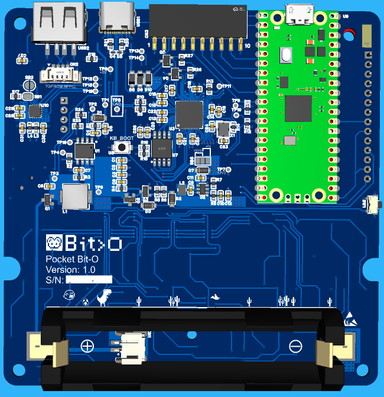
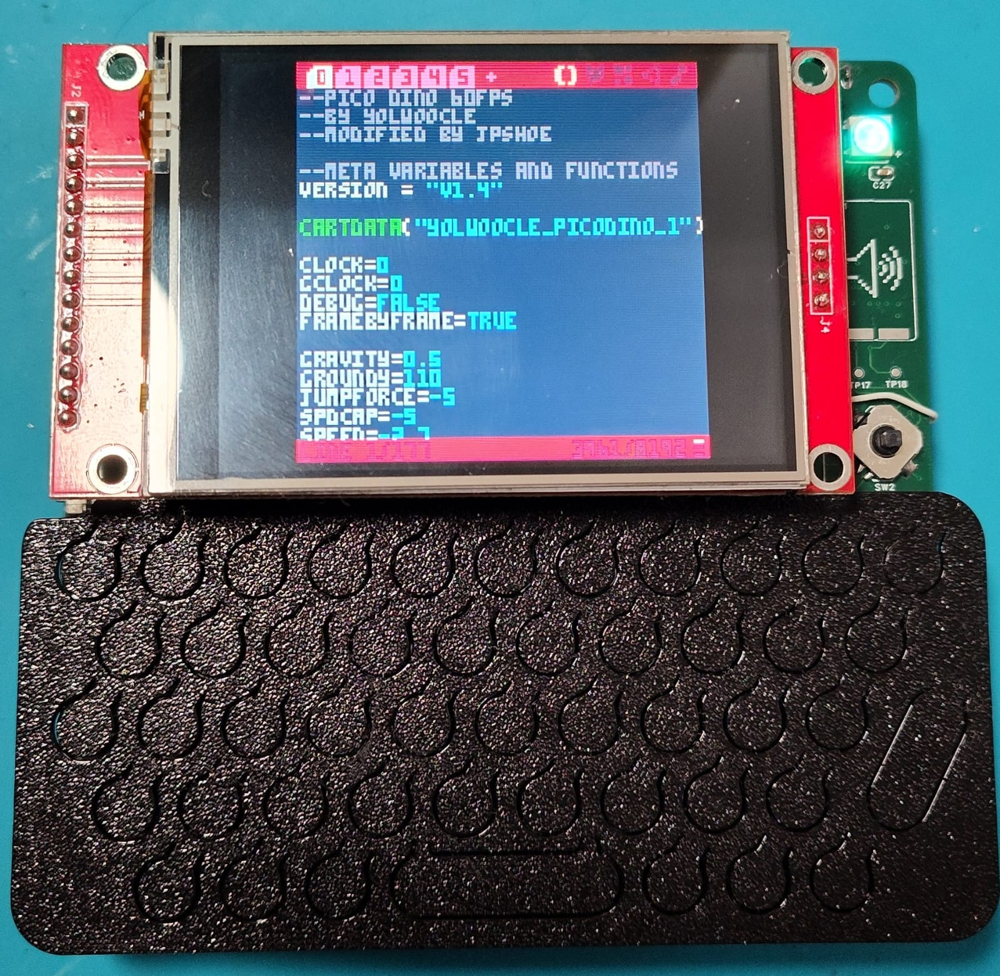
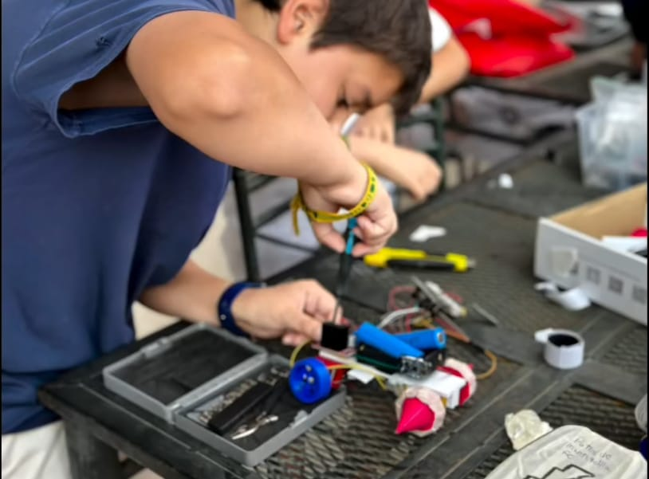
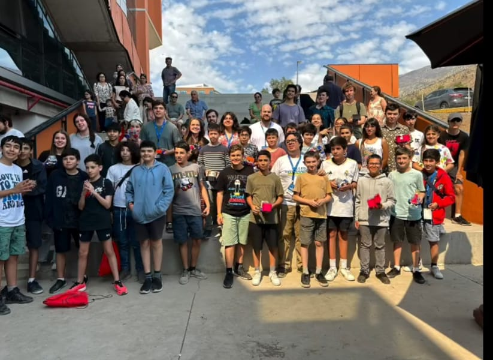
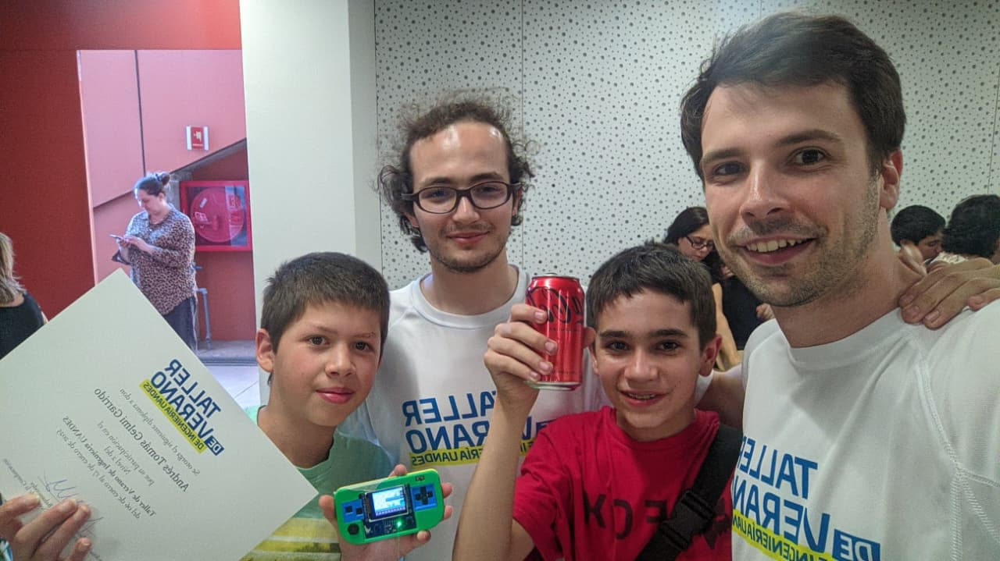
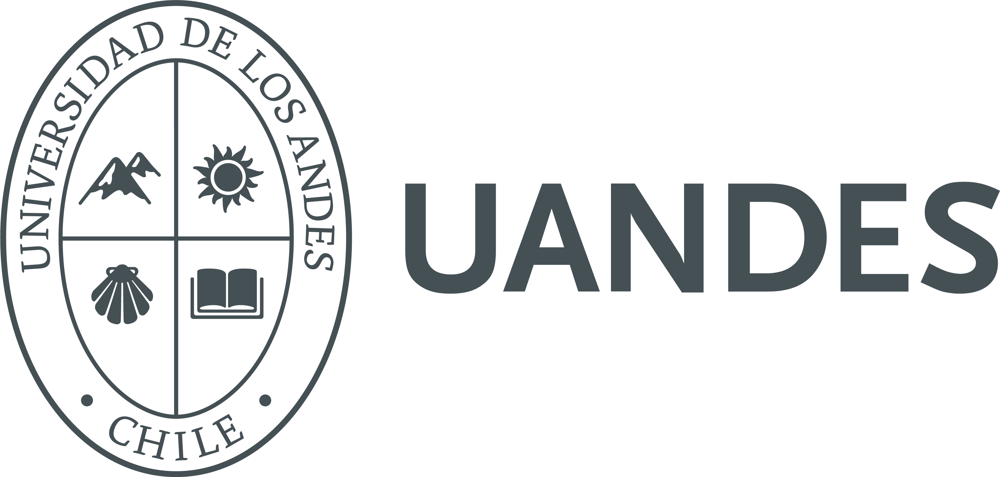
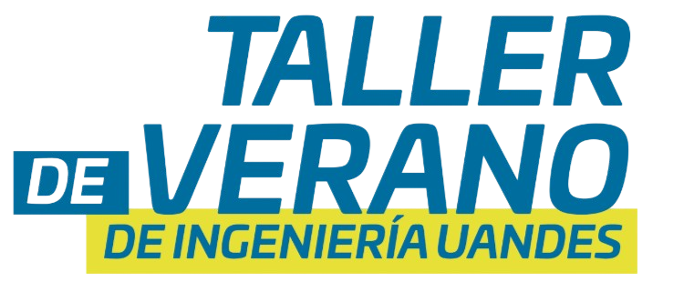



## Introducción 🚀

**Project Bit-0** es un computador educativo accesible e interactivo pensado para enseñar **programación, sistemas operativos y electrónica embebida** de forma divertida y cercana. La propuesta se apoya en una **comunidad open-source** de enseñanza y desarrollo que busca hacer estas experiencias más atractivas, inclusivas y fáciles de implementar en contextos escolares.

> [!NOTE]
> El objetivo es que las y los estudiantes pasen de **usar herramientas** a **crear soluciones tecnológicas** con una base sólida.

## El problema que queremos resolver

El avance tecnológico acelerado (impulsado por IA) está poniendo presión sobre la educación: se necesita **actualizar metodologías y contenidos** para preparar a estudiantes en un mundo cada vez más digital. Sin embargo, existe una brecha importante de acceso a recursos: se requieren laboratorios especializados y docentes con formación técnica, lo que muchas veces deriva en que el aprendizaje se concentre en **usar herramientas** más que en **crear soluciones tecnológicas** y comprender los fundamentos.

## Objetivos del proyecto 🎯

Nuestro objetivo es **diseñar y pilotear una experiencia educativa de programación y electricidad** mediante una plataforma atractiva. Esto incluye:

- Desafíos que enseñen fundamentos de **resolución de problemas computacionales**.
- Introducción a **conceptos básicos de sistemas operativos** en Linux (sistema de archivos y terminal).
- Enseñanza de **programación inicial** (Python/Lua/C++).
- Desarrollo de proyectos con **sensores y actuadores**.
- Docente como **facilitador**, con materiales guía.
- Una **interfaz interactiva** con foco en la exploración de herramientas open-source.

## Primer prototipo 🧩

En colaboración con estudiantes de pre y postgrado de la **Universidad de los Andes (Chile)** y con apoyo de **Vitatronics Chile**, estamos validando el primer prototipo y creando nuevas experiencias de aprendizaje. La idea es un **computador portátil** diseñado para introducir la interacción entre software y hardware dentro y fuera del aula.


  
  


### Hardware

- Placa con microcontrolador **RP2040** para teclado de 52 teclas, LEDs de estado, monitoreo de batería y control seguro de energía.
- Comunicación por **I²C** con una placa **Luckfox Lyra SBC** (Linux) y pantalla SPI de 2.8" (320×240).
- Sistema con **Linux personalizado** en microSD y ranura SD adicional para expansión.
- Audio con DAC/amplificador, batería Li-ion recargable por USB-C y **GPIO libre** para sensores y actuadores.

### Software

- Firmware open-source para el **RP2040**.
- **Buildroot Linux** personalizado con drivers para pantalla, teclado y audio.
- Compatibilidad con **Pico-8 Fantasy Console**, para crear juegos interactivos en Lua.
- En el roadmap: interfaz de terminal personalizada para mejorar la experiencia educativa.

> [!TIP]
> El enfoque de software facilita proyectos creativos como **microjuegos y animaciones** que conectan código, diseño y lógica.

## Metodología de trabajo 🤝

Las experiencias se estructuran como sesiones cortas y prácticas:

- **Proyectos breves** para crear programas, microjuegos y animaciones en Pico-8.
- Trabajo **colaborativo** en parejas o grupos, con apoyo de estudiantes de ingeniería.
- Proyectos que combinan software y sensores (acelerómetros y LEDs programables).
- Docente como facilitador con materiales guiados.
- **Concursos especiales** para estimular creatividad y resolución de problemas.

## Público objetivo

- **Nivel:** 6° básico a 2° medio (6th a 10th grade).
- **Contexto:** colegios públicos y particulares subvencionados.
- **Pilotos:** múltiples cursos y establecimientos.

## Impacto esperado ✨

### En estudiantes

- Mayor **curiosidad** por software y hardware.
- Más interés por ciencia y tecnología.
- Mejora en habilidades de **programación y lógica**.
- Competencias básicas en **electrónica**.
- Mejor comprensión de **cómo funciona un computador**.

### En instituciones

- Materiales que **mejoran continuamente**.
- Recursos concretos para docentes.
- Fortalecimiento del área de tecnología.
- Desafíos **atractivos y entretenidos** para estudiantes.

## Experiencias previas 📚

Project Bit-0 se apoya en la experiencia de los **Summer Camps de la Facultad de Ingeniería** de la Universidad de los Andes. Estos programas de dos semanas introducen desafíos de computación, electrónica y diseño 3D. Los estudiantes trabajan con herramientas especializadas y con el apoyo de estudiantes de ingeniería, buscando transformar su forma de resolver problemas y fortalecer el trabajo colaborativo.


  
  
  


## Plan de trabajo 🗓️

- **Fase 1:** iteración del dispositivo + prototipo + contenidos pedagógicos.
- **Fase 2:** piloto en aula con múltiples cursos + capacitación docente.
- **Fase 3:** evaluación, ajustes y producción final del kit.

## Presupuesto 💡

El presupuesto se enfoca en:

- Desarrollo y manufactura del prototipo.
- Diseño de material pedagógico.
- Capacitación docente e implementación del piloto.
- Diseño y desarrollo de software.

> [!IMPORTANT]
> El financiamiento está principalmente orientado a la **prototipación** y la **implementación del piloto**.

## Contribuyentes

El proyecto cuenta con el apoyo y colaboración de:


  
  


- **Universidad de los Andes**.
- **Taller de Ingeniería Uandes**.
- **Vitatronics**.

## Contacto

Para más información: **jflira@miuandes.cl**

---
