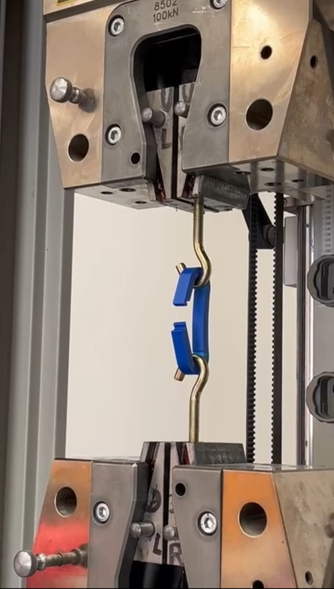
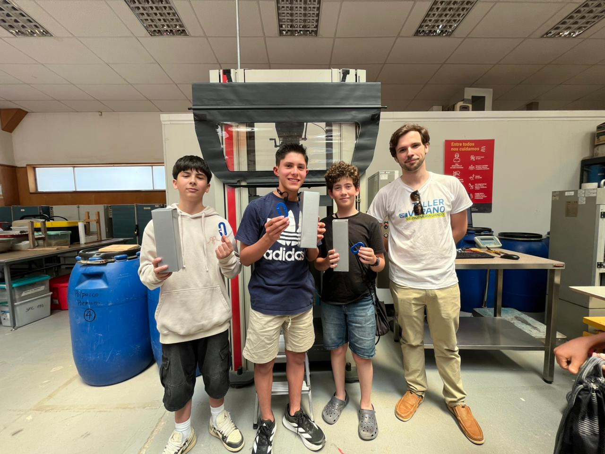
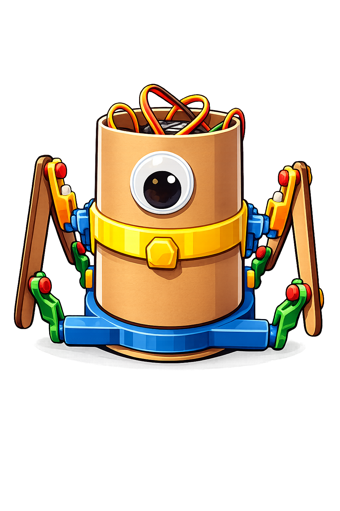
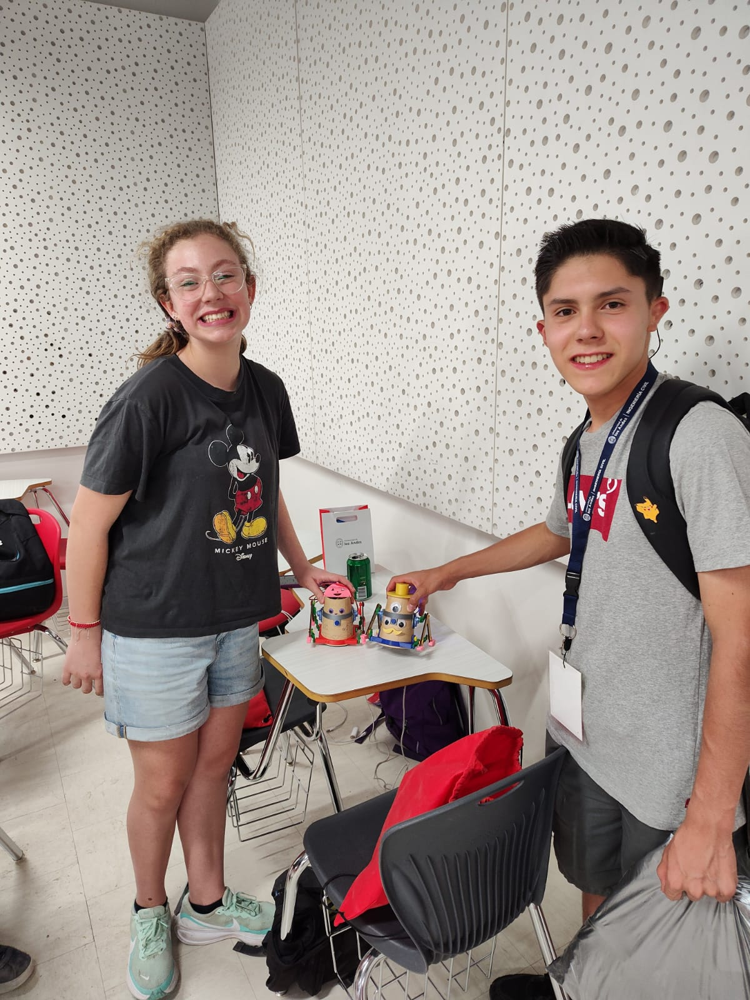
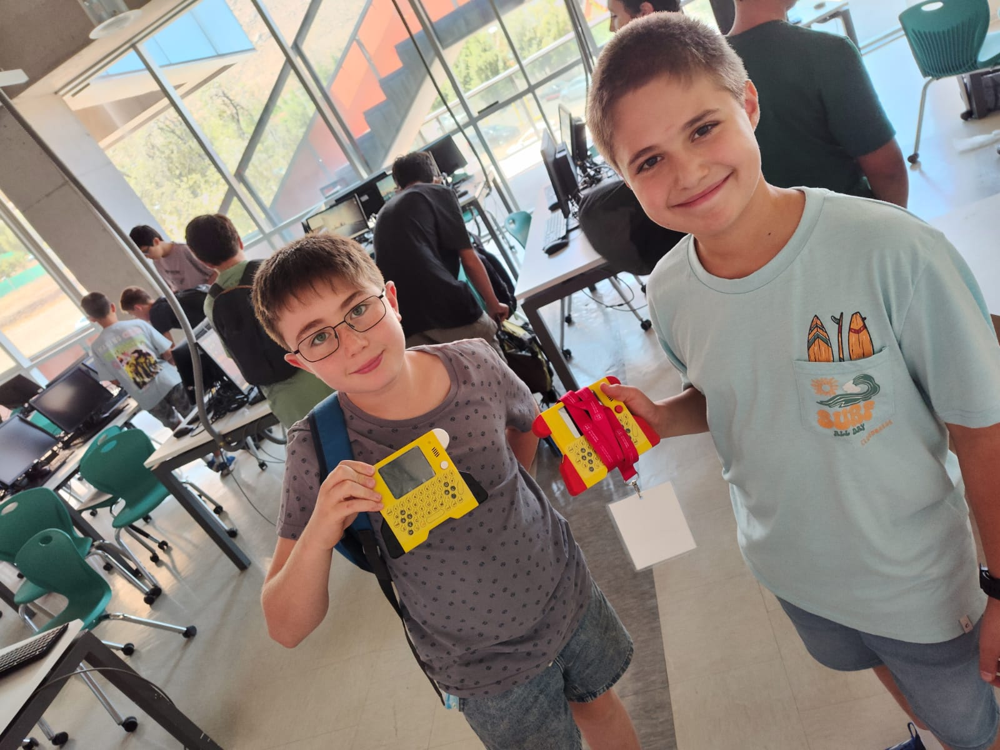
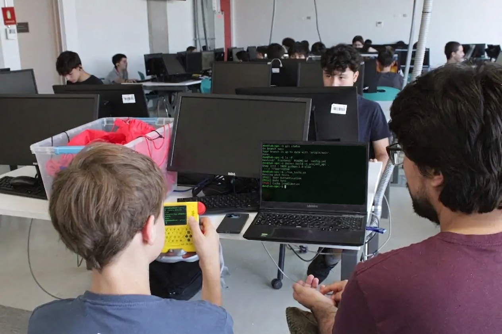
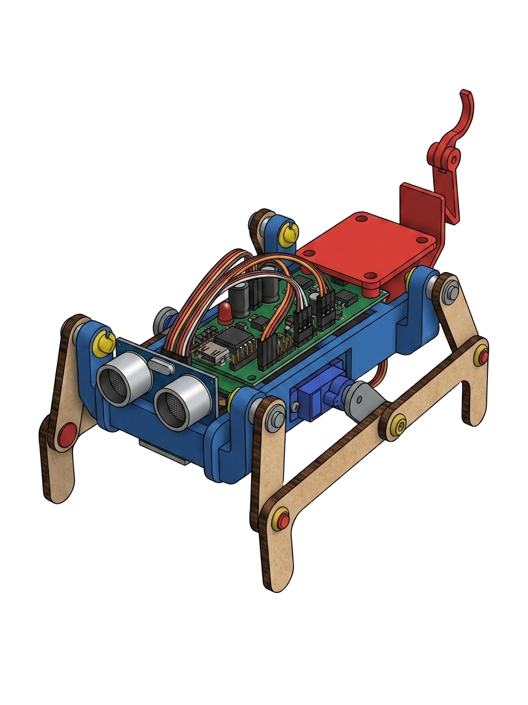
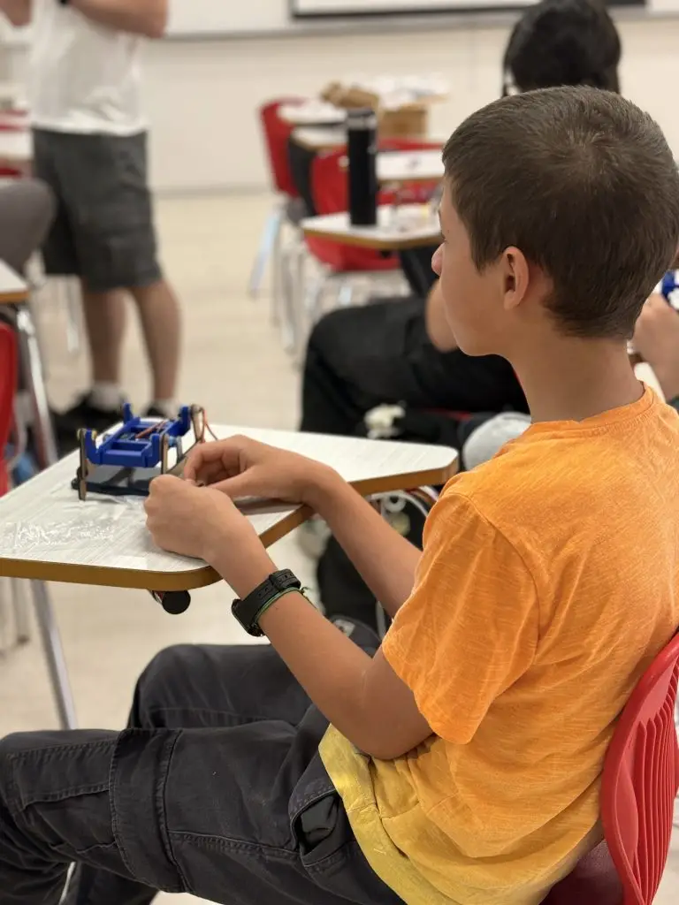
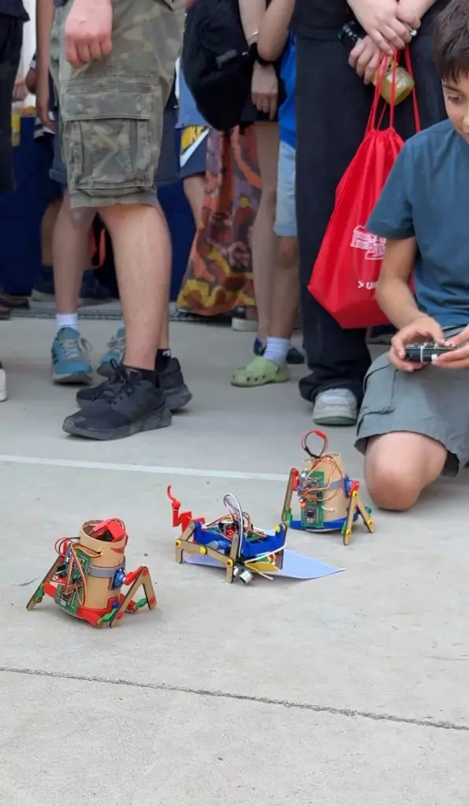
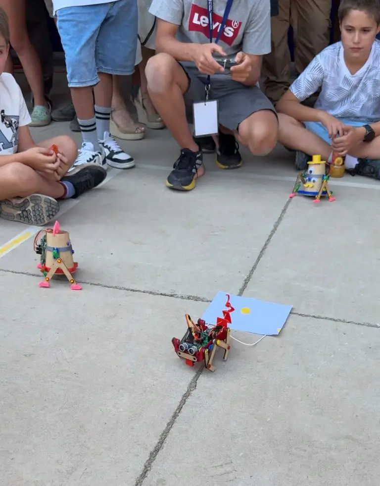



Esta foto es del último día. Pero todo comenzó de verdad empieza casi dos meses antes, con el edificio de ingeniería Matias y la Coto, una lista de materiales por comprar y yo tratando de decidir en qué orden le íbamos a enseñar a casi 70 niñas y niños de entre 12 y 16 años a diseñar, cablear y programar un robot desde cero.

Este año me tocó coordinar y diseñar los desafíos del **Taller de Verano de Ingeniería** de la Facultad de Ingeniería y Ciencias Aplicadas de la Universidad de los Andes. No fue solo "armar clases": fue pensar tres niveles completos, con una progresión que tuviera sentido, para que un estudiante que llega por primera vez a tocar un servo motor termine, entrenando su propio modelo de reconocimiento de voz.

> [!NOTE]
> Todo esto ocurrió durante enero, en pleno verano, justo después de un merecido descanso luego de navidad y año nuevo, en las salas y laboratorios del edificio de ingeniería de la universidad —el mismo que todavía se está terminando de construir al fondo del patio, como se nota en varias de las fotos de esta crónica.

## Diseñar el mapa antes de los talleres 🗺️

Antes de que llegara el primer estudiante, mi trabajo fue trazar el camino completo: **tres niveles**, cada uno con su propio desafío final, pero todos apuntando al mismo objetivo de fondo —que la Ingeniería deje de ser una caja negra.

La estructura que armamos fue esta:

- **Nivel 1 — Interactivo:** primer contacto con modelado 3D, diseño mecánico, electrónica básica y su propio **walker_bot**.
- **Nivel 2 — Programación:** construir su propio computador portátil, **bit-0**, y aprender a programar experiencias interactivas con él.
- **Nivel 3 — Avanzado:** modelado, electrónica y programación a otro nivel, sumando sensores, actuadores propios y un modelo de IA entrenado por ellos mismos para controlar su robot escorpión por voz.

Con algo de experiencia por los años anteriores tocó calcular cuánta frustración es "buena" (la que te hace iterar) y cuánta era demasiada (la que te hace abandonar el destornillador).

## Nivel 1: los primeros pasos a armar un robot 🤖

El primer nivel es, literalmente, el punto de entrada al taller: ahí conviven quienes nunca han tocado un cable con quienes ya vienen con algo de experiencia previa. El desafío final era construir un **walker_bot**, un robot caminante a control remoto, pero para llegar ahí tuvimos que pasar por varias estaciones.

Empezamos con **modelado y diseño mecánico**, usando [motiongen.io](https://motiongen.io/) para que entendieran cómo se piensa un mecanismo de caminata antes de imprimirlo o cortarlo. De ahí saltamos al **laboratorio de Obras Civiles**, donde entendimos la fuerza (literal) qué tan resistentes eran las piezas con las que íbamos a trabajar, la máquina de ensayo de esfuerzo —nada como ver tu propia pieza destruirse bajo carga para entender lo frágil que es nuestro trabajo.


  
  


Luego venía la **introducción a la electrónica**: servo motores, cables, protoboard, y la primera vez que la mayoría cerraba un circuito que realmente movía algo. Y para cerrar el nivel, una makeathon hasta conseguir armar y hacer caminar su propio walker_bot. 

Como todo lo que es mecánico, no todos los robots caminaron a la primera. Acá uno de nuestras primeras sorpresas fue un error en el código que les entregué, todos los estudiantes debían sincronizar sus controles con sus robots, pero si se quedaban en el canal por defecto, este movía todos los robots a la vez ¡ni se imaginan la sorpresa que esto fue para todos! pero estuvo bien, aparte de eso todos los estudiantes aprendieron a iterar y mejorar su montaje hasta lograr mover sus walker_bots.


  
  


> [!TIP]
> El truco de este nivel no era enseñar "todo de electrónica" en dos semanas, sino dejar que fallaran rápido y barato: mejor que un servo se trabe en el taller a que se trabe en la demo final.

## Nivel 2: aprender a programar construyendo tu propio computador 💻

Fue el desafío más grande de coordinar este taller, queríamos alejar a los estudiantes de la idea de que "programar es solo escribir código en una pantalla", y para eso diseñamos un desafío que los obligara a entender cómo funciona un computador por dentro. 

El segundo nivel cambia el foco: aquí la meta ya no es un robot que camina, sino un estudiante que entiende **pensamiento computacional**. Y para lograrlo hicimos algo que a mí, como coordinador, todavía me encanta cada vez que lo veo funcionar: los estudiantes **arman su propio computador portátil**, el **bit-0**, pieza por pieza, y después programan sobre él.


  
  


No es un computador de juguete: tiene su propio teclado, pantalla, batería, y corre un sistema pensado para programar juegos y animaciones. Ver a un estudiante de 13 años terminar de soldar su bit-0, encenderlo, y minutos después estar depurando su primer script para que un personaje reaccione a la en pantalla, es exactamente el tipo de puente entre **hardware y software** que buscábamos con este nivel, además de mostrarles cómo un computador es un lienzo en blanco que ellos mismos pueden llenar con sus propias ideas.



## Nivel 3: el escorpión que escucha 🦂🎙️

El tercer nivel es para quienes ya pasaron por los dos anteriores —o llegan con un nivel equivalente— y quieren llevar todo un paso más allá. Aquí retomamos el modelado 3D, la electrónica y la programación, pero ya no como introducción, sino como herramientas que ellos mismos empiezan a combinar con libertad.

El proyecto que armamos para este nivel fue un **robot escorpión**, con sensores ultrasónicos, servos y una placa de control expuesta a propósito para que pudieran intervenirla: agregar sus propios actuadores, sumar sensores nuevos, cambiar el diseño de las patas. Y como desafío final, fue: **entrenar su propio modelo de reconocimiento de voz** para que el escorpión reaccionara a comandos hablados por ellos mismos.


  
  


Coordinar este nivel fue distinto a los otros dos: acá mi rol pasó de "diseñar el desafío paso a paso" a "dejar suficiente espacio abierto" para que cada estudiante metiera su propia idea sin que el proyecto se desarmara en el intento. Ni se imaginan las sorpresas que nos entregaron con sus herramientas de batalla para el desafío final.

## El cierre: 70 estudiantes, tres niveles, un solo patio 🎓

El viernes 15 de enero cerramos la tercera versión del taller. Fueron dos semanas intensas, y ese día se notó: en el patio del edificio de ingeniería —todavía con la grúa de construcción de fondo— los estudiantes, junto al apoyo de sus familias, llegaron competir con sus walker_bots a control remoto, mientras nosotros, como equipo, tratábamos de moderar para que fuera lo más justo posible para alumnos del nivel 1 y 3.


  
  


Como resumió mi profesor y amigo **Matías Recabarren**, académico de la Facultad, sobre el sentido del taller:

> "Este taller es para acercar a niñas y niños a la Ingeniería y desarrollo tecnológico buscando que tengan una interacción más natural con las nuevas tecnologías, que conozcan un poco de su funcionamiento, abrirles esa caja negra. En esa misma línea, también busca un acercamiento temprano para que ellos puedan ir evaluando y desarrollando su vocación."

Y sobre algo que yo también comparto y que me tocó ver mucho coordinando los tres niveles al mismo tiempo:

> "El contraste entre niños que vienen por primera vez y aquellos que ya era su tercera, los primeros son más cautos en su interacción con la electrónica, mientras los otros ya entienden que ellos tienen el control y que hay que probar sin miedo. Es satisfactorio ver esa evolución a la cual hemos aportado un granito de arena."



Detrás de cada nivel hubo un equipo de increíbles ayudantes alumnos de ingeniería en la UAndes: los mismos que después de las clases se quedaban revisando código, armando las placas, los kits, dando clases y cuidando la comunidad de este taller. Unos grandes; Diego, Cristobal, Fernanda, Esteban, Tatan e Iván :raised_hands:

También muy importante mi equipo junto a los que desarrollamos las placas de Bit-0, un desafío de más medio año que supuso mucha iteración, diseño, electrónica y programación. Tremendos Cris, Nico y Rebe imposible lograrlo sin ustedes.



## Lo que me llevo de coordinar esto

Diseñar desafíos para 70 estudiantes repartidos en tres niveles distintos, con objetivos y ritmos distintos, me obligó a pensar la Ingeniería no como una lista de temas que "hay que pasar", sino como una progresión de confianza: que la electrónica es para todos; No solo es programar sino entender donde sobre qué se está programando; Y finalmente que todos puede diseñar a un robot a su manera.

Nos vemos el próximo verano —con una cuarta versión, y seguramente con más de un estudiante de Nivel 3 pidiendo hacer algo que todavía no sé cómo vamos a lograr que funcione.